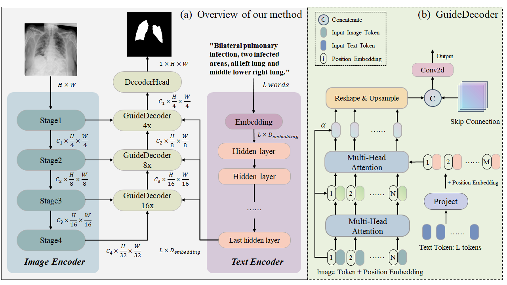
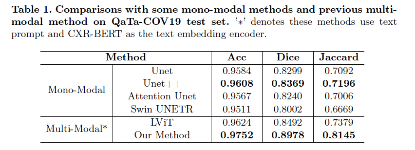

# LanGuideMedSeg-MICCAI2023
Pytorch code of MICCAI 2023 Paper-**Ariadne’s Thread : Using Text Prompts to Improve Segmentation of Infected Areas from Chest X-ray images**
(Early Acceptance-Top 14%)

arXiv paper: [https://arxiv.org/abs/2307.03942](https://arxiv.org/abs/2307.03942)


## Framework



## Requirements
1. Environment  
The main mandatory dependency versions are as follows:  
    ```
    python=3.8  
    torch=1.12.1  
    torchvision=0.13.1  
    pytorch_lightning=1.9.0  
    torchmetrics=0.10.3  
    transformers=4.24.0  
    monai=1.0.1  
    pandas  
    einops  
    ```

2. (Option)Download the pretrained model of CXR-BERT and ConvNeXt
   
   CXR-BERT-specialized see: https://huggingface.co/microsoft/BiomedVLP-CXR-BERT-specialized/tree/main  
   ConvNeXt-tiny see: https://huggingface.co/facebook/convnext-tiny-224/tree/main

   Download the file 'pytorch_model.bin' to './lib/BiomedVLP-CXR-BERT-specialized/' and './lib/convnext-tiny-224'

   Or just use these models online:
   ```
   url = "microsoft/BiomedVLP-CXR-BERT-specialized"
   tokenizer = AutoTokenizer.from_pretrained(url,trust_remote_code=True)
   model = AutoModel.from_pretrained(url, trust_remote_code=True)
   ```
   

## Dataset
1. QaTa-COV19 Dataset(images & segmentation mask)  
    QaTa-COV19 Dataset See Kaggle: [https://www.kaggle.com/datasets/aysendegerli/qatacov19-dataset](https://www.kaggle.com/datasets/aysendegerli/qatacov19-dataset)

    **We use QaTa-COV19-v2 in our experiments.**

2. QaTa-COV19 Text Annotations(from thrid party)  
    Check out the related content in LViT: [https://github.com/HUANGLIZI/LViT](https://github.com/HUANGLIZI/LViT)

    **Thanks to Li et al. for their contributions. If you use this dataset, please cite their work.**

## QuickStart
Our training is implemented based on PyTorch Lightning. Please check the relevant training settings in train.py and config.  
For example:
```train_csv_path:./data/QaTa-COV19-v2/prompt/train.csv```

To train a model, please execute:  
```python train.py```  
To evaluate a model, please excute:  
```python evaluate.py```

## Result explain
Some of you have expressed doubts about the results in *Table 1*, which are different from the std out on the results screen during training.  
Please note: The results in *Table 1* were obtained on the QaTa-COV19 **test set**. Please run ```evaluate.py``` to obtain the results on the test set instead of referring to the std out on the screen during training, while those results were obtained on the validation set!



## Citation
*TODO: Change to MICCAI 2023 Citation*

If you find our work useful in your research, please consider citing:
```
@misc{zhong2023ariadnes,
      title={Ariadne's Thread:Using Text Prompts to Improve Segmentation of Infected Areas from Chest X-ray images}, 
      author={Yi Zhong and Mengqiu Xu and Kongming Liang and Kaixin Chen and Ming Wu},
      year={2023},
      eprint={2307.03942},
      archivePrefix={arXiv},
      primaryClass={eess.IV}
}
```
